# BabyPod

This repository is for the hardware and initial setup. For the CircuitPython code that runs on the hardware, see the [`babypod-software`](https://github.com/skjdghsdjgsdj/babypod-software/) repository.

## What is it?

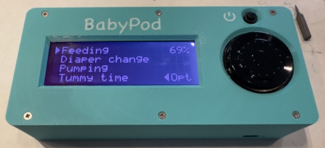

BabyPod is a remote control for [Baby Buddy](https://github.com/babybuddy/babybuddy). It's named that because it connects to Baby Buddy and has a click wheel like an old iPod.

There are already several ways of interacting with Baby Buddy, but the design goals for BabyPod are:

* **Simplicity:** instead of finding your phone and keeping it charged, launching an app (and there's no iOS app), etc., just use a dedicated device that you can make whatever color you want to find real easily. It does one thing only. Deliberately, not all features of Baby Buddy exist in BabyPod, just the most important ones.
* **Full control of your data:** you have total privacy over your data because BabyPod talks directly to your Baby Buddy instance's API.
* **Quick access:** the most commonly used things are shown first, and extra data can be added later. For example, if you record a diaper change, you can log if it was wet and/or dry, but it doesn't ask for color because usually it'll be the same and you can just add it later directly in Baby Buddy if not. Print and build multiple BabyPods if you want and leave them in places you frequent, like your baby's nursery, a place where you feed, etc.
* **Open source:** change it to do what you want.

## Hardware

To build a BabyPod, you 3D print an enclosure and stuff it with parts mainly from [Adafruit](https://www.adafruit.com/) or that you may already have.

### Parts, tools, and software needed

You can mix and match a few parts, but here's a table if you just want to pick exact parts known to work.

**If you get a different battery, the polarity may not match, and at best you destroy the board, and at worst start a fire! Adafruit batteries use opposite polarities from many other sellers!**

| Part | Quantity | Notes |
| ---- | -------- | ----- |
| [Adafruit ESP32-S3 Feather with 4MB Flash 2MB PSRAM](https://www.adafruit.com/product/5477) | 1 | Various alternatives below |
| [RGB backlight positive LCD 20x4](https://www.adafruit.com/product/499) | 1 | You can also get a [backlight negative](https://www.adafruit.com/product/498) version; both work fine |
| [i2c/SPI character LCD backpack](https://www.adafruit.com/product/292) | 1 |
| [Adafruit ANO Rotary Navigation Encoder to I2C Stemma QT Adapter](https://www.adafruit.com/product/5740) | 1 |
| [ANO Directional Navigation and Scroll Wheel Rotary Encoder](https://www.adafruit.com/product/5001) | 1 |
| [Lithium Ion Polymer Battery - 3.7v 2500mAh](https://www.adafruit.com/product/328) | 1 | Has to be specifically this battery! |
| [Mini On/Off Push-Button Switch](https://www.adafruit.com/product/3870) | 1 |
| [Terminal Block kit for Feather - 0.1" Pitch](https://www.adafruit.com/product/3173) | 1 |
| [STEMMA QT / Qwiic JST SH 4-pin Cable - 100mm Long](https://www.adafruit.com/product/4210) | 2 |
| [Small Enclosed Piezo w/Wires](https://www.adafruit.com/product/1740) | 1 |
| [Hook-up Wire Spool Set - 22AWG Solid Core - 6 x 25 ft](https://www.adafruit.com/product/1311) | 1 |
| [M2.5 button-head machine screws](https://www.amazon.com/dp/B0BC9294PD) | 1 set | These have a tiny hex head so be sure you have a driver |
| [M2 countersunk flat-head self-tapping screws](https://www.amazon.com/dp/B09DB5SMCZ) | 1 set |
| PLA or PETG 3D printing filament | Varies | You might want a bright color so you can find BabyPod quickly |
| 1.75mm transparent 3D printing filament | ~6mm | You'll cut a piece of this, not actually print with it |
| Solder and soldering iron | 
| Electrical tape |
| Wire cutters and strippers |
| Multimeter |
| USB C cable | 1 |
| 3D printer and slicing software | |

### Considerations

#### Choice of Feather

You don't need the _exact_ Feather above, but it works. If you want to use a [different one](https://www.adafruit.com/category/946), the [requirements](https://datatracker.ietf.org/doc/html/rfc2119) are as follows.

* It MUST have a USB C port, not microUSB.
* It SHOULD have a STEMMA QT port. If it doesn't, or if the Feather you pick has its STEMMA QT port inaccessible once mounted in the enclosure which is commonly the case, you'll cut the end off a STEMMA QT cable, strip its wires a bit, and connect them to the relevant ports on the terminal block. You might have to adjust the code to select the correct I2C bus.
* It MUST have the ability to charge a LiPo battery, and **the pins MUST match the polarity of the battery above!**
* It MUST support [CircuitPython](https://circuitpython.org/downloads) 9.
* It MUST NOT have any excessive protrusions or components (LCDs, preinstalled terminal blocks/headers, etc.) that would prevent it from mounting into the enclosure. Note the Feather gets mounted into the enclosure upside-down, so keep that in mind in considering if it would fit.
* It MUST support Wi-Fi, and the antenna MUST be part of the PCB, not a u.FL connector. Most boards only do 2.4 GHz, so if your Wi-Fi network is 5 GHz, it may not work.
* It MUST NOT have presoldered headers. You will solder terminal blocks, not headers.
* Non-ESP32-based Feathers are untested and MAY need code/library changes or might not work at all.
* It MUST be compliant with [Adafruit's specifications for a Feather's physical dimensions and hole locations](https://learn.adafruit.com/adafruit-feather/feather-specification), although the bottom-right hole isn't needed.
* It SHOULD have an onboard battery monitor that measures battery charge _percentage_, not just battery _voltage_. Boards with a LC709203 or MAX17048 chip work. If you pick a Feather without one of those two chips, then get an [Adafruit LC709203F LiPoly / LiIon Fuel Gauge and Battery Monitor](https://www.adafruit.com/product/4712). The assembly instructions note how to integrate it.

Another Feather that works is [Unexpected Maker's Feather ESP32-S3](https://www.adafruit.com/product/5399) which is a bit more expensive and will require the "fuel gauge" above, further adding to the cost. On the plus side, it has a STEMMA QT port on the side so you don't need to strip a cable, and its charge LED aligns with the 3D printed model. Its build of CircuitPython also does allow reading from the `VBUS` pin so BabyPod will know its charging vs. on battery state.

#### Other part variations

You can get a [backlight negative](https://www.adafruit.com/product/498) version of the LCD if you want. They're functionally identical but just differ in appearance.

## Printing the enclosure

You can print the enclosure in either one or two colors. Whichever you choose:

* Infill amount and style doesn't matter much because there isn't much to infill.
* Don't use supports.
* Enable detection of thin walls in your slicer. For PrusaSlicer, you have to change "Perimeter Generator" from "Arachne" to "Classic" to enable the checkbox for detecting thin walls. This will make the screw standoffs less likely to crack when you drive a screw into them.
* 0.2mm layer height is best. You can probably print taller layers, but it'll lower the resolution of the USB C ports and light pipe guide.
* If you set the bottom infill pattern to "Archimedian Chords", it'll look prettier. Same if you use PETG and print on a textured plate.

### One color

One single color is easiest. Print `Faceplate, no inlays.stl` upside-down (top of the faceplate facing the bed) and `Bottom case.stl` as-is.

Alternatively, instead of printing `Faceplate, no inlays.stl`, you can print `Faceplate, with inlays.stl`, still upside-down, and the printer will bridge over the text and power icon. But, if you want text and the icon, two-color printing will look nicer than just bridging.

### Two colors

In two colors, you get a text inlay that says "BabyPod" and an icon for the power button. Printing in two colors requires a printer that supports multiple filaments or [clever use of GCODE](https://old.reddit.com/r/prusa3d/comments/nt3oau/2_colors_on_the_same_layer/h0q4s6e/).

Print `Faceplate, with inlays.stl` and `Faceplate inlays.stl` as a multipart object upside-down (top of the faceplate and inlays facing the bed) and `Bottom case.stl` as-is.

If you're editing `BabyPod.scad`, your system needs these two fonts installed too:

* SF Compact Rounded, used for the power icon
* Chalkboard, used for the main text inlay


## Assembling everything after printing

### CircuitPython setup

[Install CircuitPython 9 onto the Feather](https://learn.adafruit.com/adafruit-esp32-s3-feather/circuitpython). You should do this even if your Feather came with it preinstalled.

The easiest way to do this is:

1. [Download CircuitPython 9](https://circuitpython.org/downloads) for your specific board. Get the `.bin` version, not `.uf2`.
2. Connect the Feather to your computer via USB C.
3. Press and hold the Boot button, briefly press Reset, and then release the Boot button. This puts the board in a bootloader mode.
4. In Google Chrome, go to [Adafruit's ESPTool](https://adafruit.github.io/Adafruit_WebSerial_ESPTool/).
4. Click "Connect" and select the Feather. The device's name will vary, but ultimately you should see a successful connection message.
5. Click Erase and wait about 15 seconds until you get a success message.
7. Click the first "Choose a file..." button and select the `.bin` CircuitPython image you downloaded, then click "Program."
8. When prompted to do so, press the Reset button on the Feather. A few moments later, a drive named `CIRCUITPY` should mount itself on your computer.

Some Feathers don't support transferring code by USB and you won't see a `CIRCUITPY` drive. Refer to their specific instructions on how to load code, which is usually via Wi-Fi and the serial console.

### Create `settings.toml`

Create a plain text file that looks like this. Strings must be double-quoted.

```
CIRCUITPY_WIFI_SSID_DEFER="..."
CIRCUITPY_WIFI_PASSWORD_DEFER="..."
CIRCUITPY_WIFI_INITIAL_CHANNEL=0
BABYBUDDY_BASE_URL="..."
BABYBUDDY_AUTH_TOKEN="..."
```

Populate it as follows:

| Variable | Value |
| -------- | ----- |
| `CIRCUITPY_WIFI_SSID_DEFER` | Your Wi-Fi network's SSID (name) |
| `CIRCUITPY_WIFI_PASSWORD_DEFER` | Your Wi-Fi network's password |
| `CIRCUITPY_WIFI_INITIAL_CHANNEL` | The 2.4 GHz channel number of your Wi-Fi network. If you have _only one_ Wi-Fi access point and its channel number never changes, you can set this for a faster startup. Otherwise, or if you want to be safer, leave this set to 0 for auto. |
| `BABYBUDDY_BASE_URL` | Baby Buddy's API endpointn URL, including a trailing slash and `/api/`; for example, `http://10.1.2.3:1234/api/` |
| `BABYBUDDY_AUTH_TOKEN` | Your authorization token for Baby Buddy's API. You can generate one by logging into Baby Buddy, clicking your username and going to Settings. |

Optionally, you can add the following as well:
| Variable | Value |
| -------- | ----- |
| `BACKLIGHT_COLOR_FULL` | `int` representing the backlight color at full brightness, like `0xFF0000` for bright red; white is the default |
| `BACKLIGHT_COLOR_DIM` | `int` representing the backlight color when dimmed, like `0x660000` for a dimmer red; gray is the default | 

Name it `settings.toml` and copy it to the root of the `CIRCUITPY` drive. Be sure your operating system didn't add a hidden `.txt` extension.

### Copy the code

Download the latest release and extract it. Copy everything in it to the root of the `CIRCUITPY` drive. If you get a warning that you'll overwrite `code.py` then that's good, because you will.

Disconnect the Feather from the USB C cable.

### Initial wiring

#### Soldering the basic components
1. Solder the rotary encoder wheel to its breakout board. It only fits one way. Don't solder the included headers.
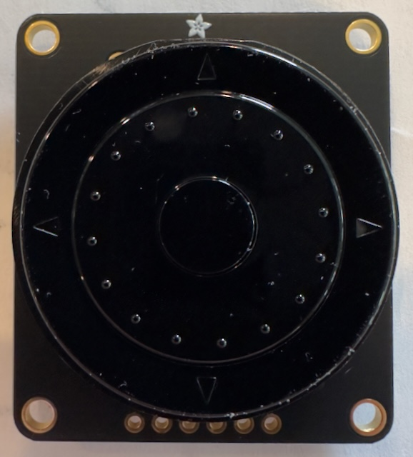 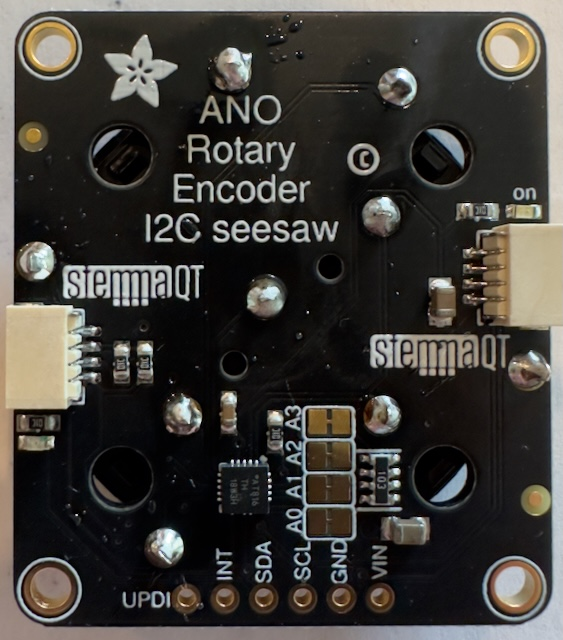
	
2. Solder the terminal headers to the _bottom_ of the Feather with the connection points for the wires _facing inwards towards each other_. That is: the USB C and battery connectors must be on one side and the terminal headers on the other, and wires going into the terminals enter from the middle of the Feather, not the outside.
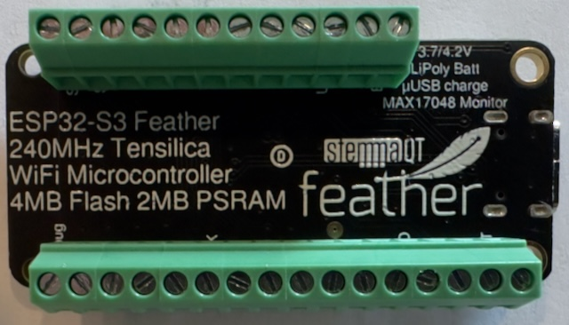
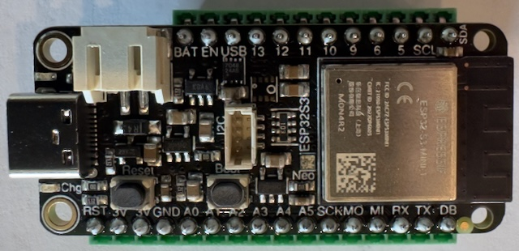
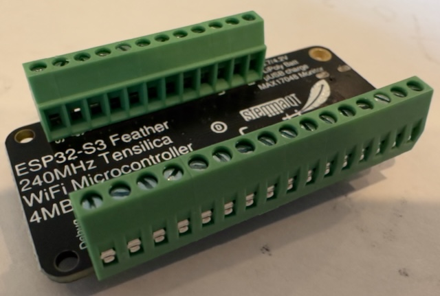

#### Soldering the LCD

Read carefully!

1. Cover the back of the LCD where the backpack will mount with electrical tape to avoid shorts.
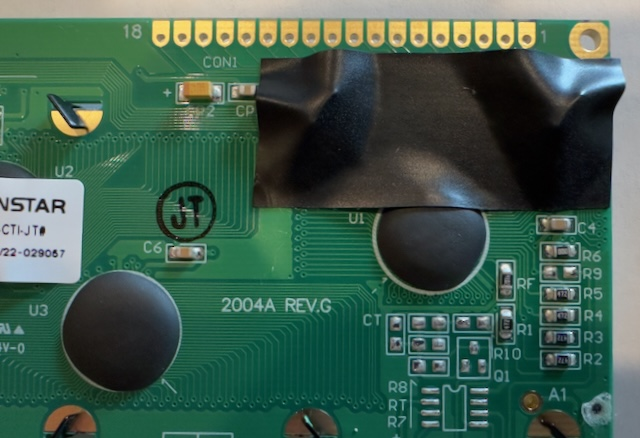

2. Solder headers to _all but the last three pins_ of the LCD; i.e., pins 1 to 15, and omit 16 to 18. The long end of the headers stick up towards the top of the LCD. The plastic part of the header and the shorter pins are on the bottom of the LCD.
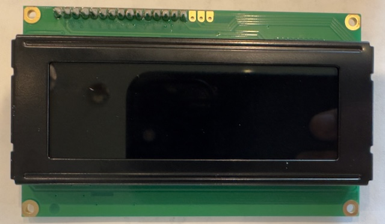 
	
3. Solder a red wire to pin 16, a green wire to pin 17, and a red wire to pin 18. These wires control the LCD backlight and are color-coded for each color channel. Orient the wires so they are parallel to the LCD itself and don't extend beyond the top edge of the board.
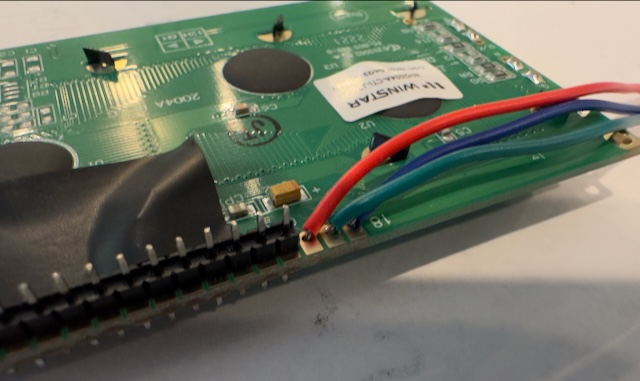
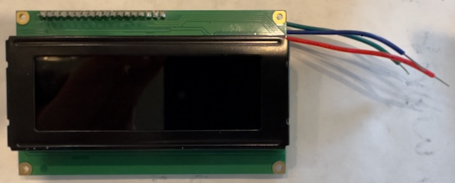

4. Solder the backpack to the short header pins on the back of the LCD. Note that the last pin on the backpack isn't connected. Then connect a 100mm STEMMA QT cable to the bottom port on the backpack.

	Take note of the white screw-adjusted potentiometer on the left side of the backpack. After you build everything, if the display is blank or black, you will need to adjust this screw to adjust the LCD's contrast.
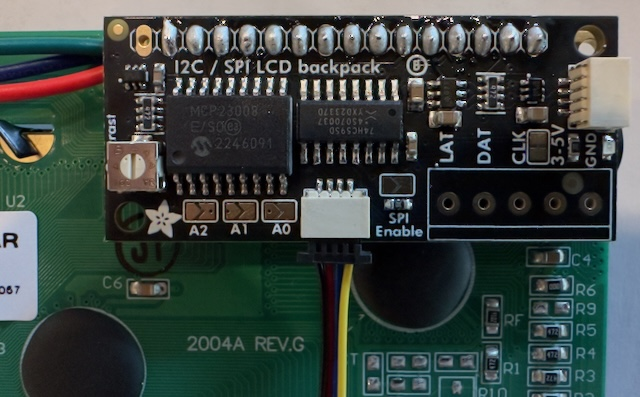
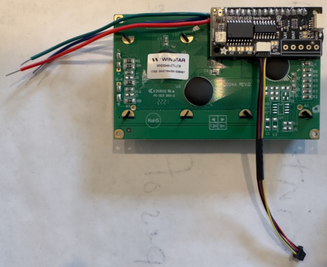

#### Power button
You'll wire up the power button similar to how you'd wire an electrical switch in your house that has screw terminals.

1. Using a multimeter, test continuity on the on/off switch. If there _is_ continuity, continue on. If there is _not_ continuity, press the switch and verify there is now continuity.<br><br>When the switch is _on_, the Feather is actually _off_ because it shorts the `EN` pin to `GND`. Shorting those two pins cuts power to the Feather, and later when we plug in the battery, we want the Feather to stay off.<br><br>
2. Cut a couple white wires about 50mm long and strip about 5mm of the insulation from each end.
3. With each wire, bend one exposed end around a 4mm screw clockwise. Leave the other end straight. Be sure just the exposed portion of the wire is around the screw and not any insulation. If you need, strip more insulation to make it fit. 
4. Place the power button on its mounting point with the button facing the top towards the user.
5. Screw the power button into place pretty tightly. When you're done, the power button should be screwed in place with wires sandwiched securely between the metal tabs of the power button and the screws' heads. Give the wires a tug to make sure they're mounted well.
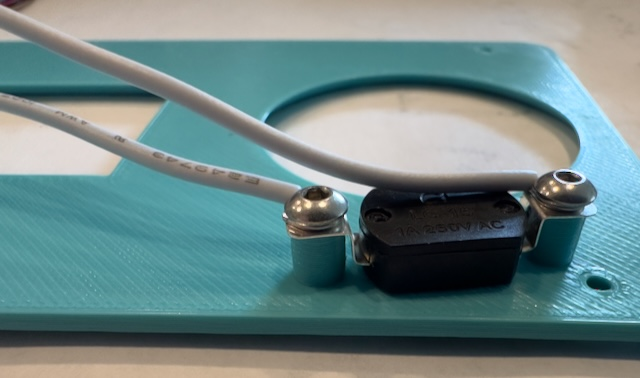
6. Connect the two wires to the `EN` and `GND` pins of the Feather. It doesn't matter which one goes where.
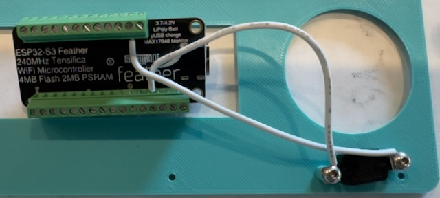

### Shoving everything in the enclosure

1. Remove the paper retaining tape from the battery and press-fit the battery into its rectangular spot on the bottom of the enclosure. It should be held in place but not require excessive force. Orient the battery such that the wire is at the bottom-right of its mounting spot.
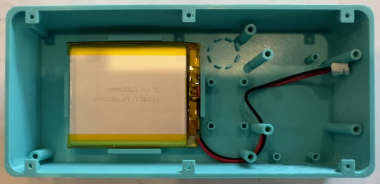
2. Remove the protective paper covering the adhesive on the piezo and press-fit it into its circular spot. Make sure the hole in the piezo is facing up. Orient the piezo such that the wires are at the three-o-clock position. Be careful: the piezo has very thin wires and attempting to move it later could rip them off.
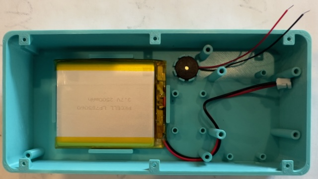
3. If you're using the LiPo fuel gauge because you're using a Feather without a battery monitor, screw it into the four closely-spaced standoffs, plug the battery into it, and plug the JST cable it came with into the other port. Also plug the LCD's STEMMA QT cable into the fuel gauge and then another STEMMA QT cable into the other port.
4. Mount the LCD assembly. The top-left of the LCD sits on a little notch and doesn't take a screw. Use 6mm screws for the other corners.
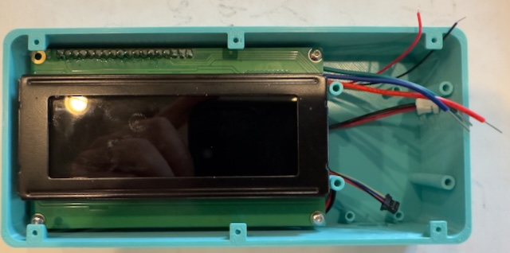
5. Plug the STEMMA QT cable from the LCD into the left side of the rotary encoder when viewed from below, or if you're using a fuel gauge, use the STEMMA QT cable from that.
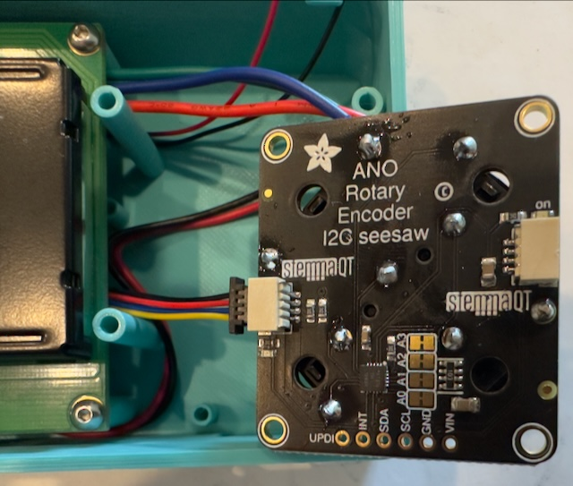
6. Plug the battery cable into the Feather, either from the battery directly, or if you're using a fuel gauge, the JST cable from that. The Feather shouldn't turn on! If it does, your power switch is not set right or the wires are not connected properly.
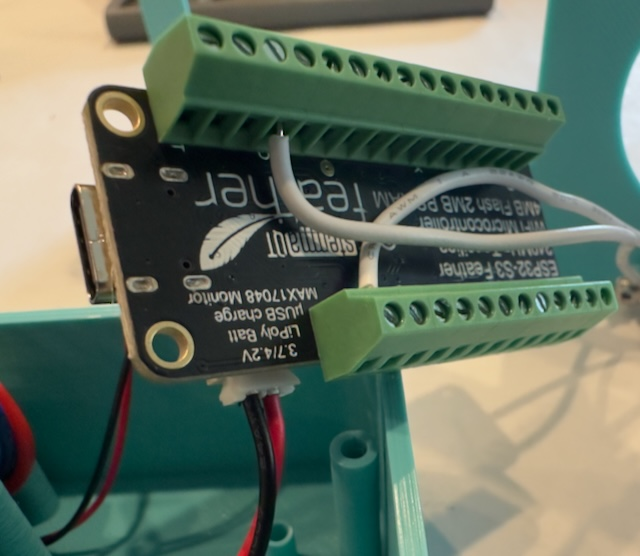
7. Mount the Feather. If only the front two screws fit, it's fine. Some Feathers will let you screw in the back screw, but don't force one through the Feather!
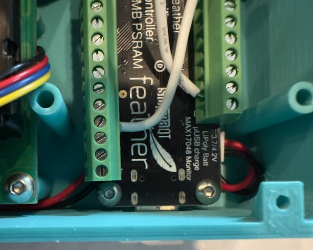
8. If you're lucky and your Feather has a STEMMA QT port accessible while the board is mounted, plug in a 100mm cable. But if it's on the bottom inaccessible or there isn't one:
	1. Cut the end off a 100mm STEMMA QT cable and strip about 4mm of insulation.
	2. Plug black into `GND`, red into `3V`, blue into `SDA`, and yellow into `SCL`. Yes, there will be two wires in the `GND` terminal; be careful both are securely attached.
	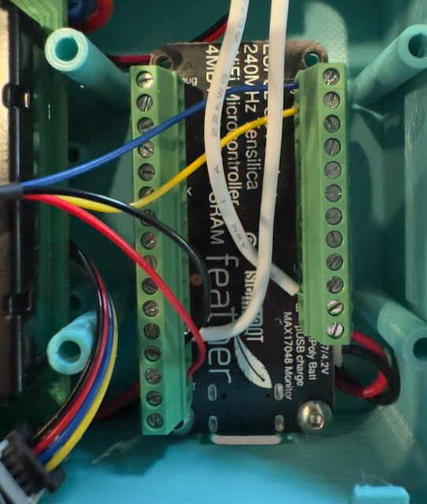
9. Connect the red piezo wire to `A3` and black to `GND`. Yes, now there might be _three_ wires in the `GND` terminal and it'll be fiddly to keep them in place. Be sure they're all secure before continuing.

10. Connect the three LCD RGB backlight wires: green to `5`, blue to `6`, and red to `9`. Note the order of the connections is _not_ "RGB."
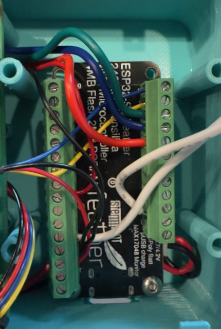
11. Connect the Feather's STEMMA QT cable to the other port of the rotary encoder then mount it in place. Note the orientation: the headers are on the left and the Adafruit logo on the right.

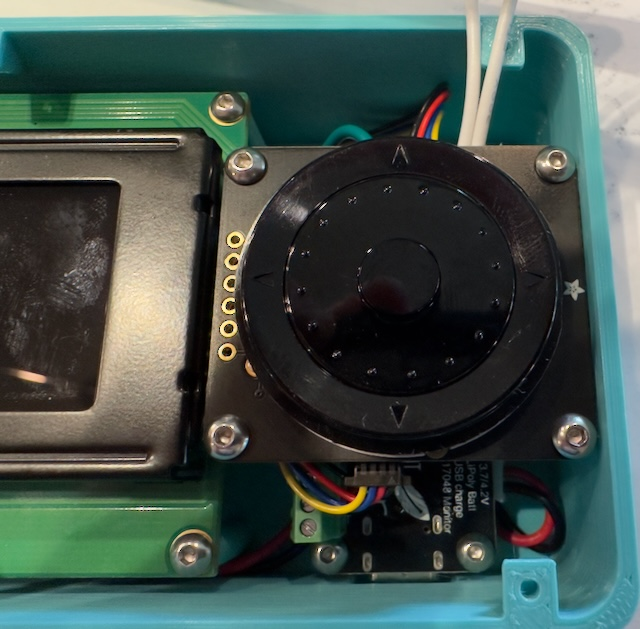
12. Screw the top cover into place. Be careful not to loosen the wires looped around the power switch screws. Use the countersunk self-tapping screws. Press the power button, and after a few seconds, you should see this!

13. Take a tiny bit, about 5mm, of the 1.75mm transparent filament and shove it in the hole by the USB port. It will act as a light pipe to the charge LED on the Feather (ideally) or the user-controllable LED (well, useful at some point).

## Troubleshooting

### Power-related

- Check the power switch. Yes it sounds obvious, but not only will the BabyPod be off, but the Feather doesn't show up on USB either when the power is off.
- Is the battery charged? The battery is 2500mAh and the Feather's charging speed means it can take a long time to fully charge from 0%. Different Feathers charge at different speeds. The BabyPod will charge even when off. You can verify by checking the charge LED on the Feather, if yours has one.
- Does the board stay on even when the power switch is off? The wires came off the screws holding the switch in place or are loose on the Feather's `GND` and `EN` pins. When you screw down or remove the faceplate, if the screws aren't tight enough, the wires can slip off the screws pretty easily.
- Is the battery plugged into the Feather completely? If you're using a fuel gauge, is the battery fully plugged into that and a separate JST cable going from the fuel gauge's other port to the Feather?
- Did you use an Adafruit battery and Adafruit Feather? If you didn't, then you may have reversed the battery polarity and destroyed the Feather. Smoke may have been another clue.

### Software-related

- Did you install CircuitPython 9 and load all the code, including the relevant libraries? Have you tried an older version of CircuitPython (still 9.x.x) in case there was a breaking change?
- Is the code crashing? [Connect to a serial console and watch the output.](https://learn.adafruit.com/welcome-to-circuitpython/kattni-connecting-to-the-serial-console) Note the code disables the auto-reload when you write a file which is different from CircuitPython's default operation. In a serial console, you can press `Ctrl-C` to stop the code and then `Ctrl-D` to reboot which will capture all the output from the moment it boots up. If you're using macOS, then [tio](https://formulae.brew.sh/formula/tio) makes it easy to use serial consoles in the terminal; the device is `/dev/tty.usbmodem*`.
- Does the menu show up but you get various errors when you actually try to _do_ something, like recording a feeding or changing? Your `settings.toml` is probably wrong, either for the Wi-Fi credentials, Wi-Fi channel if you specified one, or Baby Buddy's URL or authorization token. The serial console should help you here.
- Are you using a recent version of Baby Buddy for your server? Or perhaps your version is _too_ new and there's an API-breaking change?

### Other things to check

- Is the LCD contrast adjusted? There's a [potentiometer on the back of the LCD backpack](https://learn.adafruit.com/i2c-spi-lcd-backpack?view=all) you can turn with a small flathead screwdriver. Carefully leave all the components wired together, but unscrew the faceplate, then the rotary encoder, then the LCD, and carefully lever the latter outside the case. While the Feather is on and the code is running, slowly adjust the potentiometer until it looks better.
- Did you put enough electrical tape between the LCD board and the backpack so they don't short?
- Are all the connections to the screw terminals on the Feather good and tight? Give them a gentle tug. Especially check the connections on the `GND` terminal because there could be _three_ and it's hard to get them all locked down.
- Are the solder connections good? Are any insufficient, or maybe two adjacent pins are bridged together accidentally?
- Did you miss any solder points when mounting the click wheel to the rotary encoder board?
- Did you solder the correct headers for the LCD and its backpack? Re-read that section because you're supposed to skip a few pins.
- When plugging in a USB C cable, is it snapping fully into the port on the Feather, or is the enclosure preventing it from going all the way in?
- Are all the relevant STEMMA QT connections in use? You should have:
	- One port free on the LCD backpack and the other in use
	- Both ports in use on the fuel gauge, if you're using one
	- Both ports in use on the rotary encoder
	- A STEMMA QT cable coming from the Feather either from its STEMMA QT port, if accessible, or hardwired to the `GND`/`3V`/`SDA`/`SCL` pins.
