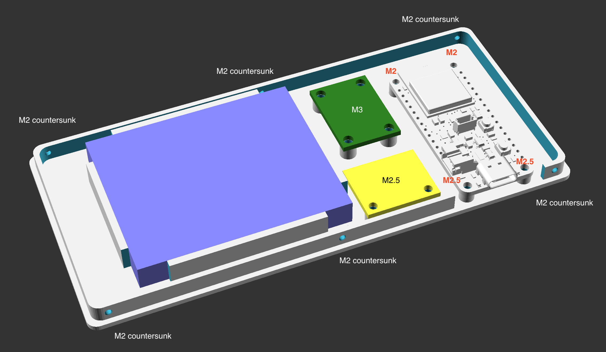

# BabyPod

This repository is for the hardware and initial setup. For the CircuitPython code that runs on the hardware, see the [`babypod-software`](https://github.com/skjdghsdjgsdj/babypod-software/) repository. This documentation assumes you're using the latest commit of `main` from the software repository.

## What is it?

BabyPod is a remote control for [Baby Buddy](https://github.com/babybuddy/babybuddy). It's named that because it connects to Baby Buddy and has a click wheel like an old iPod.

Why use BabyPod instead of just your phone or something else, or even Baby Buddy in general?

* **Simplicity:** instead of finding your phone and keeping it charged, launching an app (and there's no iOS app), etc., just use a dedicated device that you can make whatever color you want to find easily and that stays charged a long time. It does one thing only. Deliberately, not all features of Baby Buddy exist in BabyPod, just the most commonly used ones.
* **Full control of your data:** you have total privacy over your data because BabyPod talks directly to your Baby Buddy instance's API.
* **Quick access:** the most commonly used things are shown first, and extra data can be added later. For example, if you record a diaper change, you can log if it was wet and/or dry, but it doesn't ask for color because usually it'll be the same and you can just add it later directly in Baby Buddy if not. Print and build multiple BabyPods if you want and leave them in places you frequent, like your baby's nursery, a place where you feed, etc. For multiple children, you can print and build multiple BabyPods and assign each one to a specific child.
* **Open source:** change it to do what you want. As long as you don't sell it, I don't care what you do with it. Contributing back would be nice!

## Hardware

To build a BabyPod, you 3D print some parts, stuff it with some electronics with easy soldering, and load the software.

### Parts, tools, and supplies needed

Here's what you need to build a BabyPod. Prices are USD at the time of authoring and you can possibly find parts cheaper elsewhere, but this is to give you a nominal idea of how much the project costs.

Note that you can get most of these parts from the manufacturer directly like [Adafruit](https://www.adafruit.com/) and [Sparkfun](https://www.sparkfun.com/), and also resellers like [Digikey](https://www.digikey.com/), [Mouser](https://www.mouser.com/), and if you're lucky, [Micro Center](https://www.microcenter.com/) locally. The prices on Amazon are usually inflated.

Deviate from the parts list at your own risk, but _do not get a different battery!_ Adafruit batteries have polarities that match their own boards, and using a battery off Amazon or elsewhere may not match and destroy your board or even start a fire!

| Part                                                                                                         | Quantity | Price      |
|--------------------------------------------------------------------------------------------------------------|----------|------------|
| [Adafruit ESP32-S3 Feather with 4MB Flash 2MB PSRAM](https://www.adafruit.com/product/5477)                  | 1        | $17.50     |
| [Sparkfun 20x4 SerLCD](https://www.sparkfun.com/products/16398)                                              | 1        | $26.95     |
| [Adafruit ANO Rotary Navigation Encoder to I2C Stemma QT Adapter](https://www.adafruit.com/product/5740)     | 1        | $4.95      |
| [ANO Directional Navigation and Scroll Wheel Rotary Encoder](https://www.adafruit.com/product/5001)          | 1        | $8.95      |
| [Lithium Ion Polymer Battery - 3.7v 2500mAh](https://www.adafruit.com/product/328)                           | 1        | $14.95     |
| [STEMMA QT / Qwiic JST SH 4-pin Cable - 100mm Long](https://www.adafruit.com/product/4210)                   | 2        | $0.95      |
| [STEMMA QT / Qwiic JST SH 4-pin Cable - 50mm Long](https://www.adafruit.com/product/4399)                    | 1        | $0.95      |
| [Small Enclosed Piezo w/Wires](https://www.adafruit.com/product/1740)                                        | 1        | $0.95      |
| [Adafruit SPI Flash SD Card - XTSD 512 MB](https://www.adafruit.com/product/4899)                            | 1        | $9.50      |
| [Adafruit PCF8523 Real Time Clock Breakout Board - STEMMA QT / Qwiic](https://www.adafruit.com/product/5189) | 1        | $4.95      |
| **Total**                                                                                                    |          | **$91.55** |

You will also need the following supplies. The manufacturer doesn't matter but some examples are linked below:

* A [CR1220 button cell battery](https://www.adafruit.com/product/380)	
* Screws:
  * [M2](https://www.amazon.com/dp/B0B6HVS3SJ)x4, quantity 2
  * [M2.5](https://www.amazon.com/dp/B0BC9294PD)x6, quantity 4
  * M2.5x4, quantity 8
  * [M3](https://www.amazon.com/dp/B0CSX4L42C)x4, quantity 4
  * [Self-tapping countersunk M2](https://www.amazon.com/dp/B09DB5SMCZ)x4, quantity 6
* [22AWG solid core hookup wire](https://www.adafruit.com/product/1311)
* 3D printing filament of your choice; PETG works nicely
* A USB C cable capable of both data and charging
* Solder
* 1.75mm *transparent* 3D printing filament, ~6mm worth; this acts as a light pipe and you won't actually print using it

And lastly, tools:
* Small screwdriver
* Wire cutters/strippers
* Soldering iron
* A 3D printer
* A computer with a USB C port

## Printing the enclosure

You can print the enclosure in either one or two colors. Whichever you choose:

* Infill amount and style doesn't matter much because there isn't much to infill.
* Don't use supports.
* 0.2mm layer height is best. Avoid variable height layers because it'll make the LCD and rotary encoder insets look weird.
* If you set the [bottom infill pattern to "Archimedian Chords"](https://help.prusa3d.com/article/infill-patterns_177130#types-of-top-bottom-layer-infill) on both parts, it'll look prettier. Same if you use PETG and print on a [textured plate](https://www.prusa3d.com/product/textured-powder-coated-steel-sheet/).

If you're editing `BabyPod.scad`, your system needs the font "SignPainter" installed.

### One color

Print `Case.stl` upside-down and `Baseplate.stl` as-is.

### Two colors

Printing in two colors requires a printer that supports multiple filaments or [clever use of GCODE](https://old.reddit.com/r/prusa3d/comments/nt3oau/2_colors_on_the_same_layer/h0q4s6e/).

Print `Case.stl` and `Faceplate inlays.stl` as a multipart object upside-down (top of the faceplate and inlays facing the bed) and `Bottom case.stl` as-is.

## Layout

Here is where everything fits in the enclosure. The perimeter of each part has holes for self-tapping countersunk M2x4 screws and line up once you press the two parts together. If they don't line up, something between the two parts is in the way, like a wire.

### `Case.stl`

* The red board is the LCD module. It is held in place to its standoffs with four M2.5x6 screws.
* The rotary encoder is obvious. It uses four M2.5x4 screws. Note the position of the pins on the left side.
* The hole for the USB C port on the Feather is visible. Next to it is a hole for the 1.75mm transparent filament to act as a light pipe to the charge LED on the Feather.

### `Baseplate.stl`

* The blue rectangle is the battery. The cable will exit by the bottom-left. It is press fit.
* The green board is the [RTC](https://en.wikipedia.org/wiki/Real-time_clock). The vertical orientation doesn't matter. It uses four M3x4 screws. The battery faces up and the STEMMA QT ports face down.
* The yellow board is the Flash SD board. The components face up and the flat surface faces down. It uses two M2.5x4 screws.
* The white board is the Feather. It is screwed in using two M2.5x4 screws in the front near the USB C port, and in the back the smaller holes of the Feather use two M2x4 screws.
* The piezo isn't visible. It is under the yellow Flash SD board. It is press fit like the battery. The hole in the piezo faces down and the wires exit through the hole in the circle.

## Assembly

You want to install CircuitPython and set up the software *before* assembling the hardware.

### CircuitPython setup

[Install CircuitPython 9.1.4 onto the Feather](https://learn.adafruit.com/adafruit-esp32-s3-feather/circuitpython), even though it was probably preinstalled. You want to get the right version and erase any unnecessary files.

1. [Download CircuitPython 9.1.4](https://circuitpython.org/board/adafruit_feather_esp32s3_4mbflash_2mbpsram/) for your specific board. Get the `.bin` version, not `.uf2`.
2. Connect the Feather to your computer via USB C.
3. Press and hold the Boot button, briefly press Reset, and then release the Boot button. This puts the board in a bootloader mode.
4. In Google Chrome, go to [Adafruit's ESPTool](https://adafruit.github.io/Adafruit_WebSerial_ESPTool/). Firefox and some other browsers don't work because the tool needs WebSerial support.
5. Click "Connect" and select the Feather. The device's name will vary, but ultimately you should see a successful connection message.
6. Click Erase and wait about 15 seconds until you get a success message.
7. Click the first "Choose a file..." button and select the `.bin` CircuitPython image you downloaded, then click "Program."
8. When prompted to do so, press the Reset button on the Feather. A few moments later, a drive named `CIRCUITPY` should show up on your computer.

Keep the Feather plugged in for the next steps.

### Load the BabyPod software

1. Download the [latest release of the BabyPod software](https://github.com/skjdghsdjgsdj/babypod-software/releases) and extract the zip file to a new folder somewhere.
2. In the extracted files, rename `settings.toml.example` to `settings.toml`. Make sure your OS doesn't sneak a `.txt` extension onto it.
3. [Create a free account](https://learn.adafruit.com/welcome-to-adafruit-io/getting-started-with-adafruit-io) on [adafruit.io](https://io.adafruit.com/). You'll need your username and API key in the next step. You can get those when you're logged in by clicking the [yellow key icon at the top-right of the page](https://io.adafruit.com/api/docs/#authentication).
4. Open `settings.toml` in a text editor and modify it as comments in the file show, then save it.
5. Copy everything inside the new folder (not the folder itself) including your renamed `settings.toml` file to the `CIRCUITPY` drive. Overwrite anything already on the drive.

Even though there isn't much to copy, it might take a few minutes. At this point, all the software is ready to go, and once you've assembled the hardware, it should connect to your Wi-Fi, log into Baby Buddy, and run normally.

### Soldering

#### Overview

Here is a logical diagram of how everything connects. This isn't physically how everything is laid out in the enclosure but just shows what pins go where. Don't start soldering yet!

* Blue wires are [STEMMA QT](https://learn.adafruit.com/introducing-adafruit-stemma-qt/what-is-stemma-qt) cables ([I2C](https://learn.adafruit.com/circuitpython-basics-i2c-and-spi/i2c-devices)). These don't get soldered. On boards with two STEMMA QT connectors, the connections are interchangeable. The LCD's connector is labeled "QWIIC" which is just Sparkfun's name for the same connector.
* The yellow wire is the only soldered wire on the rotary encoder and connects its `INT` pin to the Feather's `11`.
* Black wires are all `GND` and red wires are all +3.3V. The black wire is the only soldered wire on the RTC.
* The orange wire on the piezo goes to `A3`.
* The green wires are all used for [SPI](https://learn.adafruit.com/circuitpython-basics-i2c-and-spi/spi-devices) communication for the Flash SD card.
* The battery plugs directly into the Feather's battery terminal.
* The rotary encoder *dial* itself isn't shown, but it gets soldered to its respective board directly.

Before soldering, orient yourself to where everything mounts to the 3D printed parts. You want to use just enough wire to reach each connection point, but not too much excess or you won't be able to fit everything inside the enclosure. It may help to keep [Adafruit's pinout documentation of the Feather](https://learn.adafruit.com/adafruit-esp32-s3-feather/pinouts) open while you're soldering. Triple check which pin you're soldering to before you actually do it!

Many of the boards ship with a strip of headers included. You won't use them.

#### Soldering

Solder the rotary encoder dial to its breakout board. It only fits one way. Be careful not to skip any connections.

Then solder the following connections from the respective devices to their targets:

| Device               | Pin/Wire   | To                   |
|----------------------|------------|----------------------|
| Piezo                | Black wire | `GND` on the RTC     |
| Piezo                | Red wire   | `A3` on the Feather  |
| Flash SD card        | `VIN`      | `3V` on the Feather  |
| Flash SD card        | `GND`      | `GND` on the Feather |
| Flash SD card        | `SCK`      | `SCK` on the Feather |
| Flash SD card        | `MISO`     | `MI` on the Feather  |
| Flash SD card        | `MOSI`     | `MO` on the Feather  |
| Flash SD card        | `CS`       | `10` on the Feather  |
| Rotary encoder board | `INT`      | `11` on the Feather  |

The piezo wires are very thin, so be careful. Less solder is best.

Note that all the soldered wires are between the Feather and the Flash SD card with two exceptions:

* The rotary encoder's `INT` pin goes to the Feather.
* The piezo's black ground wire goes to the RTC.

### Mount components

When screwing in components, use just enough force to keep things in place. Don't over-tighten the screws or you'll strip the non-existent threads in the 3D printed parts and need to print them again. Repeatedly screwing into the same standoff may also strip it, even if it's not over-tightened, and you'll need to reprint.

The plugs on STEMMA QT cables only fit one way. Don't use a lot of force or you can easily bend one of the thin pins in their ports.

If you need to, you can change the order of the steps below if shoving everything into the enclosure is finicky.

1. Connect the LCD to the rotary encoder using one of the 100mm STEMMA QT cables. It doesn't matter which port on the rotary encoder you use. On the other STEMMA QT port on the rotary encoder, plug in another 100mm STEMMA QT cable. It'll later connect to other components, but not yet.
2. Screw the rotary encoder into place with four M2.5x4 screws. The set of pins on it, including where you soldered the `INT` wire, should face towards the cutout for the LCD and the star with the Adafruit logo by the outer edge of the case with the STEMMA QT connectors pointing to the top and bottom of the case.
3. Use four M2.5x6 screws to screw the LCD into place into the case. The "QWIIC" connector (what Adafruit calls "STEMMA QT") should point towards the rotary encoder and the LCD screen faces out towards the cutout for it.
4. Set aside the case for now.
5. Press the piezo into place in its circle on the baseplate with the hole facing down and the wire protruding through the cutout in the circle. You can keep the white bit of tape on.
6. Screw the Flash SD board into place above the piezo with two M2.5x4 screws with the components facing up.
7. Put the CR1220 battery into the RTC; note the polarity. Screw the RTC into place with four M3x4 screws with the battery facing up. The direction doesn't matter.
8. Screw the Feather into place with the USB C port facing towards the cutout in the case and the board's components facing up. Use two M2.5x4 screws for the larger holes and two M2x4 screws for the smaller ones.
9. Plug the 50mm STEMMA QT cable into the Feather's port and into the nearest port on the RTC, then connect the STEMMA QT cable from the assembled case with the rotary encoder into the other port on the RTC.
10. Press the battery into its retainer with the cable by the bottom-left, assuming the Feather's USB C port is facing you. Don't plug in the battery's cable into the Feather yet.

### Testing before final assembly

At this point, you should have all the connections made except the battery. You can test the BabyPod by plugging in the USB C cable and seeing if it starts up. If you hear a beep and the main menu shows up then your connections are likely good.

If you don't hear a beep but everything else seems to work, make sure the piezo is soldered properly per the connections above and that the RTC's STEMMA QT connections are solid.

### Final assembly

If the test passed, continue on:

1. Unplug the USB C cable from the Feather.
2. Plug the battery into the Feather. The BabyPod will boot up.
3. Carefully press together the two 3D printed parts, being sure to align the USB C hole to the Feather. Make sure the reset hole guide is unobstructed and there are no wires stuck underneath it.
4. Screw the backplate and the enclosure together with the countersunk self-tapping M2 screws. Be especially careful not to over-tighten!
5. Shove the little bit of transparent 1.75mm filament into the hole next to the USB C connector until it is flush with the outside of the case. It acts as a light pipe for the Feather's charge LED. You might want to use pliers. If you want, carefully apply a tiny drop of superglue to hold it in place, but friction alone is probably sufficient.

## Basic usage

Head over to the [`babypod-software`](https://github.com/skjdghsdjgsdj/babypod-software/) repository for how to use the BabyPod.

## Troubleshooting

Shove a paperclip in the hole under the rotary encoder to press the Feather's reset button. This is a hardware reset that should always work. You can reset in software by pressing and holding the Down button too if the BabyPod is listening for user input.

Hint: to take apart the BabyPod, there are tiny divots on the left and right of the enclosure. You can hook your fingernails in there for leverage.

### Power and wiring-related

- Most obviously, check all your solder connections. It's easy to accidentally solder the wrong pin, or common mistakes like too little or too much solder.
- Is the battery charged? The battery is 2500mAh and the Feather's charging speed means it can take a long time to fully charge from 0%. Even with a dead battery, the BabyPod should still function when powered by USB. If you don't see the orange charge LED illuminated by the USB C port then the board isn't getting power.
- Is the battery plugged into the Feather completely? Be careful removing the battery connector; it's an extremely tight fit, so gently work it out with pliers or a screwdriver and _never pull on the battery wires!_
- Did you use an Adafruit battery and Adafruit Feather? If you didn't, then you may have reversed the battery polarity and destroyed the Feather. Adafruit tends to use the opposite polarity as most batteries sold on Amazon and other places.
- Are all the relevant STEMMA QT connections in use? Every available STEMMA QT port (or QWIIC in the case of the LCD) should be in use. Technically speaking the order of the connections doesn't matter, but do be sure everything is connected in a chain and there are no empty STEMMA QT ports.
- Is the screen completely blank? Assuming of course everything else is wired correctly, the battery might be fully discharged. During soft shutdown, the screen should still show the charge percent and "⊙ Power". If the LCD fails to initialize in software, it may appear blank too; see below for troubleshooting that.
- Is the charge LED flickering or blinking on and off very quickly? The battery is probably not connected properly or needs replacing. The charge LED flickers when the Feather believes no battery is connected.
- Is pressing and holding the Center button not turning off the BabyPod, or does pressing it when the BabyPod is off not wake it back up? Make sure `USE_SOFT_POWER_CONTROL` is set to `1` in `settings.toml`.
- Similarly, is the BabyPod shutting off automatically after a few minutes, but you have a physical power switch so it won't wake back up? Set `USE_SOFT_POWER_CONTROL` to `0` in `settings.toml`.

### Software-related

- Does random crap like corrupted characters show up on the screen? Check that all the STEMMA QT connections are secure, not just to the LCD but to the Feather, RTC, and rotary encoder too.
- Did you install CircuitPython 9 and load all the code, including the relevant libraries? Have you tried an older version of CircuitPython (still 9.x.x) in case there was a breaking change?
- Is the code crashing? [Connect to a serial console and watch the output.](https://learn.adafruit.com/welcome-to-circuitpython/kattni-connecting-to-the-serial-console) Note the code disables the auto-reload when you write a file which is different from CircuitPython's default operation. In a serial console, you can press `Ctrl-C` to stop the code and then `Ctrl-D` to reboot which will capture all the output from the moment it boots up. If you're using macOS, then [tio](https://formulae.brew.sh/formula/tio) makes it easy to use serial consoles in the terminal; the device is `/dev/tty.usbmodem*`.
- Does the menu show up but you get various errors when you actually try to _do_ something, like recording a feeding or changing? Your `settings.toml` is probably wrong, either for the Wi-Fi credentials, Wi-Fi channel if you specified one, or Baby Buddy's URL or authorization token. The serial console should help you here.
- Are you using a recent version of Baby Buddy for your server? Or perhaps your version is _too_ new and there's an API-breaking change?
- Are you getting errors about incompatible `.mpy` files? You need to install the right version of CircuitPython (9.1.4).
- Does setting the clock fail? You omitted the `adafruit.io` credentials or got them wrong in `settings.toml`. If you rotated your key on `adafruit.io`, you need to update it in `settings.toml` too.
- Maybe there's a bug. Let me rephrase that: there are most definitely bugs and maybe you ran into one. Check the [GitHub issues for the software](https://github.com/skjdghsdjgsdj/babypod-software/issues) and [submit a new issue](https://github.com/skjdghsdjgsdj/babypod-software/issues/new) if you don't see yours covered.

### Other things to check

- Is the BabyPod booting up normally, getting to the main menu, but then after a few seconds says "Rebooting" and does so? The Down button is being held. If you aren't touching it, the tolerance between the rotary encoder and the enclosure might be too tight. Try to adjust it by putting thin washers on the standoffs that hold the rotary encoder.
- Is the LCD contrast adjusted? The Sparkfun LCD contrast is adjusted through code so you'll need to poke around in the CircuitPython REPL to adjust it. The Adafruit LCD that's also supported uses a potentiometer to adjust the contrast.
- When plugging in a USB C cable, is it snapping fully into the port on the Feather, or is the enclosure preventing it from going all the way in?
- Does your USB C cable support both data and power? Test it with another device to be sure. Avoid USB A to USB cables and try to use C-to-C, assuming your computer has a USB C port too.
- Is the rotary encoder acting erratically, like "up" is acting like "down"? Make sure it's oriented properly: the row of pins is towards the center of the case, not the outside edge, as pictured above.
- Is the RTC failing to initialize or acting weird? Make sure the CR1220 button cell battery is installed. If it's just acting erratically or failing to initialize, the battery may be missing or not making good contact. If the clock keeps drifting or getting set every time you start up, the battery is probably dead. If the timezone is consistently off by an hour or a multiple of hours, then `adafruit.io` might be getting your timezone wrong.