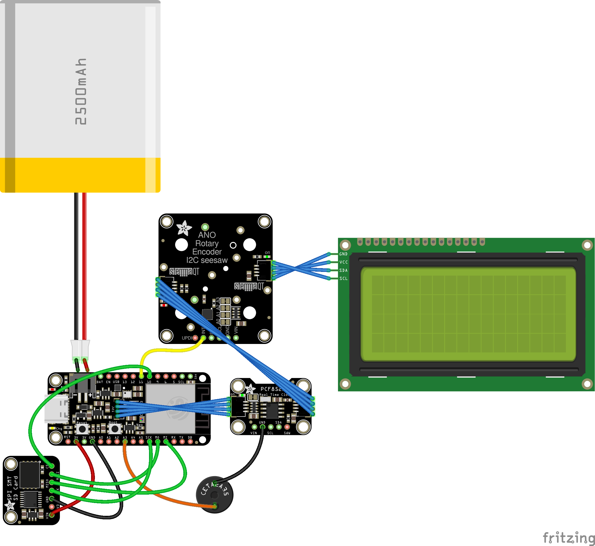

# BabyPod

This repository is for the hardware and initial setup. For the CircuitPython code that runs on the hardware, see the [`babypod-software`](https://github.com/skjdghsdjgsdj/babypod-software/) repository. This documentation assumes you're using the latest commit of `main` from the software repository.

## What is it?

BabyPod is a remote control for [Baby Buddy](https://github.com/babybuddy/babybuddy). It's named that because it connects to Baby Buddy and has a click wheel like an old iPod.

Why use BabyPod instead of just your phone or something else, or even Baby Buddy in general?

* **Simplicity:** instead of finding your phone and keeping it charged, launching an app (and there's no iOS app), etc., just use a dedicated device that you can make whatever color you want to find easily and that stays charged a long time. It does one thing only. Deliberately, not all features of Baby Buddy exist in BabyPod, just the most commonly used ones.
* **Full control of your data:** you have total privacy over your data because BabyPod talks directly to your Baby Buddy instance's API.
* **Quick access:** the most commonly used things are shown first, and extra data can be added later. For example, if you record a diaper change, you can log if it was wet and/or dry, but it doesn't ask for color because usually it'll be the same and you can just add it later directly in Baby Buddy if not. Print and build multiple BabyPods if you want and leave them in places you frequent, like your baby's nursery, a place where you feed, etc. For multiple children, you can print and build multiple BabyPods and assign each one to a specific child.
* **Open source:** change it to do what you want. As long as you don't sell it, I don't care what you do with it. Contributing back would be nice!

## Hardware

To build a BabyPod, you 3D print some parts, stuff it with some electronics with easy soldering, and load the software.

### Parts, tools, and supplies needed

Here's what you need to build a BabyPod. Prices are USD at the time of authoring and you can possibly find parts cheaper elsewhere, but this is to give you a nominal idea of how much the project costs.

Note that you can get most of these parts from the manufacturer directly like [Adafruit](https://www.adafruit.com/) and [Sparkfun](https://www.sparkfun.com/), and also resellers like [Digikey](https://www.digikey.com/), [Mouser](https://www.mouser.com/), and if you're lucky, [Micro Center](https://www.microcenter.com/) locally. The prices on Amazon are usually inflated.

Deviate from the parts list at your own risk, but _do not get a different battery!_ Adafruit batteries have polarities that match their own boards, and using a battery off Amazon or elsewhere may not match and destroy your board or even start a fire!

| Part                                                                                                         | Quantity | Price  |
|--------------------------------------------------------------------------------------------------------------|----------|--------|
| [Adafruit ESP32-S3 Feather with 4MB Flash 2MB PSRAM](https://www.adafruit.com/product/5477)                  | 1        | $17.50 |
| [Sparkfun 20x4 SerLCD](https://www.sparkfun.com/products/16398)                                              | 1        | $26.95 |
| [Adafruit ANO Rotary Navigation Encoder to I2C Stemma QT Adapter](https://www.adafruit.com/product/5740)     | 1        | $4.95  |
| [ANO Directional Navigation and Scroll Wheel Rotary Encoder](https://www.adafruit.com/product/5001)          | 1        | $8.95  |
| [Lithium Ion Polymer Battery - 3.7v 2500mAh](https://www.adafruit.com/product/328)                           | 1        | $14.95 |
| [STEMMA QT / Qwiic JST SH 4-pin Cable - 100mm Long](https://www.adafruit.com/product/4210)                   | 2        | $0.95  |
| [STEMMA QT / Qwiic JST SH 4-pin Cable - 50mm Long](https://www.adafruit.com/product/4210)                    | 1        | $0.95  |
| [Small Enclosed Piezo w/Wires](https://www.adafruit.com/product/1740)                                        | 1        | $0.95  |
| [Adafruit SPI Flash SD Card - XTSD 512 MB](https://www.adafruit.com/product/4899)                            | 1        | $9.50  |
| [Adafruit PCF8523 Real Time Clock Breakout Board - STEMMA QT / Qwiic](https://www.adafruit.com/product/5189) | 1        | $4.95  |
| [Short Feather Male Headers - 12-pin and 16-pin Male Header Set](https://www.adafruit.com/product/3002)      | 1        | $0.50  |
| [Short Headers Kit for Feather - 12-pin + 16-pin Female Headers](https://www.adafruit.com/product/2940)      | 1        | $1.50  |
| [FeatherWing Proto - Prototyping Add-on For All Feather Boards](https://www.adafruit.com/product/2884)       | 1        | $4.95  |

Note the headers are the *short headers* that Adafruit sells, not the full height ones that come with most boards. Do not use full height headers or the boards won't fit in the enclosure!

You will also need the following supplies. The manufacturer doesn't matter but some examples are linked below:

* A [CR1220 button cell battery](https://www.adafruit.com/product/380)	
* Screws:
  * [M2](https://www.amazon.com/dp/B0B6HVS3SJ)x4, quantity 2
  * [M2.5](https://www.amazon.com/dp/B0BC9294PD)x6, quantity 4
  * M2.5x4, quantity 8
  * [M3](https://www.amazon.com/dp/B0CSX4L42C)x4, quantity 4
  * [Self-tapping countersunk M2](https://www.amazon.com/dp/B09DB5SMCZ)x4, quantity 6
* [22AWG solid core hookup wire](https://www.adafruit.com/product/1311)
* 3D printing filament of your choice; PETG works nicely
* A USB C cable capable of both data and charging
* Solder
* 1.75mm *transparent* 3D printing filament, ~6mm worth; this acts as a light pipe and you won't actually print using it

And lastly, tools:
* Screwdriver that works with the screws you picked
* Wire cutters/strippers
* Soldering iron
* A 3D printer
* A computer with a USB C port

## Printing the enclosure

You can print the enclosure in either one or two colors. Whichever you choose:

* Infill amount and style doesn't matter much because there isn't much to infill.
* Don't use supports.
* 0.2mm layer height is best. You can probably print taller layers, but it'll lower the resolution of the USB C ports and light pipe guide.
* If you set the [bottom infill pattern to "Archimedian Chords"](https://help.prusa3d.com/article/infill-patterns_177130#types-of-top-bottom-layer-infill) on both parts, it'll look prettier. Same if you use PETG and print on a [textured plate](https://www.prusa3d.com/product/textured-powder-coated-steel-sheet/).

If you're editing `BabyPod.scad`, your system needs the font "SignPainter" installed.

### One color

Print `Case.stl` upside-down and `Baseplate.stl` as-is.

### Two colors

Printing in two colors requires a printer that supports multiple filaments or [clever use of GCODE](https://old.reddit.com/r/prusa3d/comments/nt3oau/2_colors_on_the_same_layer/h0q4s6e/).

Print `Case.stl` and `Faceplate inlays.stl` as a multipart object upside-down (top of the faceplate and inlays facing the bed) and `Bottom case.stl` as-is.

## Layout

Here is where everything fits in the enclosure. The perimeter of each part has holes for self-tapping countersunk M2x4 screws and line up once you press the two parts together. If they don't line up, something between the two parts is in the way, like a wire.

### `Case.stl`

* The red board is the LCD module. It is held in place to its standoffs with four M2.5x6 screws.
* The rotary encoder is obvious. It uses four M2.5x4 screws. Note the position of the pins on the left side.
* The hole for the USB C port on the Feather is visible. Next to it is a hole for the 1.75mm transparent filament to act as a light pipe to the charge LED on the Feather.

### `Baseplate.stl`

* The blue rectangle is the battery. The cable will exit by the bottom-left. It is press fit.
* The green board is the [RTC](https://en.wikipedia.org/wiki/Real-time_clock). The vertical orientation doesn't matter. It uses four M3x4 screws. The battery faces up and the STEMMA QT ports face down.
* The yellow board is the Flash SD board. The components face up and the flat surface faces down. It uses two M2.5x4 screws.
* The bottom white board is the Feather and on top, held in place by the short headers, is the FeatherWing proto. The Feather is screwed in using two M2.5x4 screws in the front near the USB C port, and in the back (hard to see in the picture) the smaller holes of the Feather use two M2x4 screws. The screws hold just the Feather itself in place. They don't go through both the Feather and the FeatherWing Proto.
* The piezo is the red circle underneath the yellow Flash SD board. It is press fit like the battery. The hole in the piezo faces down and the wires exit through the hole in the circle.

## Assembly

### CircuitPython setup

[Install CircuitPython 9.1.4 onto the Feather](https://learn.adafruit.com/adafruit-esp32-s3-feather/circuitpython), even though it was probably preinstalled. You want to get the right version and erase any unnecessary files.

1. [Download CircuitPython 9.1.4](https://circuitpython.org/board/adafruit_feather_esp32s3_4mbflash_2mbpsram/) for your specific board. Get the `.bin` version, not `.uf2`.
2. Connect the Feather to your computer via USB C.
3. Press and hold the Boot button, briefly press Reset, and then release the Boot button. This puts the board in a bootloader mode.
4. In Google Chrome, go to [Adafruit's ESPTool](https://adafruit.github.io/Adafruit_WebSerial_ESPTool/).
5. Click "Connect" and select the Feather. The device's name will vary, but ultimately you should see a successful connection message.
6. Click Erase and wait about 15 seconds until you get a success message.
7. Click the first "Choose a file..." button and select the `.bin` CircuitPython image you downloaded, then click "Program."
8. When prompted to do so, press the Reset button on the Feather. A few moments later, a drive named `CIRCUITPY` should mount itself on your computer. Keep the Feather plugged in.

### Load the BabyPod software

1. Download the [latest release of the BabyPod software](https://github.com/skjdghsdjgsdj/babypod-software/releases).
2. Extract the release zip or tarball.
3. Copy everything from the extracted release release to the `CIRCUITPY` drive, overwriting anything already on the drive.

Even though there isn't much to copy, it might take a few minutes.

### Create `settings.toml`

1. Rename `settings.toml.example` on the `CIRCUITPY` drive to `settings.toml`. Make sure your OS doesn't sneak a `.txt` extension onto it.
2. Open `settings.toml` in a text editor and modify it as comments in the file show, then save it.
3. Wait a few seconds, then unplug the Feather from your computer.

### Soldering

#### Overview

Here is a logical diagram of how everything connects. The FeatherWing isn't pictured and this isn't physically how everything is laid out in the enclosure; this just shows what pins go where. Don't start soldering yet!

* Blue wires are [STEMMA QT](https://learn.adafruit.com/introducing-adafruit-stemma-qt/what-is-stemma-qt) cables ([I2C](https://learn.adafruit.com/circuitpython-basics-i2c-and-spi/i2c-devices)). These don't get soldered. There is a ["QWIIC" connector](https://www.sparkfun.com/qwiic) on the back of the LCD board to which a STEMMA QT cable plugs in. STEMMA QT and QWIIC are functionally identical; the former is what Adafruit calls the connection and the latter is Sparkfun's name.
* The yellow wire is the only soldered wire on the rotary encoder and connects its `INT` pin to the Feather's `11`.
* Black wires are all `GND`.
* The red wire on the Flash SD board gets +3.3V from the Feather's `3V` pin.
* The red wire on the piezo goes to `A3`.
* The green wires are all used for [SPI](https://learn.adafruit.com/circuitpython-basics-i2c-and-spi/spi-devices) communication for the Flash SD card.
* The battery plugs directly into the Feather's battery terminal.
* The rotary encoder *dial* itself isn't shown, but it gets soldered to its respective board directly.

#### Before you start

Before soldering, orient yourself to where everything mounts to the 3D printed parts. You want to use just enough wire to reach each connection point, but not too much excess or you won't be able to fit everything inside the enclosure.

It may help to keep [Adafruit's pinout documentation of the Feather](https://learn.adafruit.com/adafruit-esp32-s3-feather/pinouts) open while you're soldering. Pay very close attention to soldering wires to the FeatherWing proto. Always be aware of which side has the shorter or longer header, and if you're looking at it upside down or right-side up. Triple check which pin you're soldering to before you actually do it!

There are a few important points to keep in mind when using the FeatherWing Proto:

* Look at the [pinout](https://learn.adafruit.com/featherwing-proto-and-doubler/proto-pinout). The headers get soldered to the outermost set of pins in the white bordered areas. The white printed area faces up.
* The leftmost column of pins that has a white border around it is the +3.3V bus. You can use any of those solder points to get +3.3V power.
* Similarly, the column of pins immediately to the right of the +3.3V bus are all ground pins. Solder to any of them for a ground connection.
* The rows of pins immediately below the top header and immediately above the bottom header share connections with the Feather's underlying pins. For example, the top-right pin goes to `SDA` via the male header into the Feather's female header, and the pin on the FeatherWing immediately below that one is shared with that pin, so it too goes with `SDA`.
* The pins between the headers in the middle of the board aren't connected to anything and are meant for prototyping, hence the name of the product. That is, they *do not connect to the Feather and you should not solder to them for assembling the BabyPod!*

Many of the boards ship with headers included. Don't solder those!

#### Solder rotary encoder

Solder the rotary encoder dial to its breakout board. It only fits one way. Be careful not to skip any connections.

#### Solder headers

1. Solder the short female headers to the top of the Feather (i.e., the side with all the components on it).
2. [Solder the short male headers to the bottom of the FeatherWing Proto.](https://learn.adafruit.com/featherwing-proto-and-doubler/assembly). The printed text on the FeatherWing must be on top and the long pins of the headers and their plastic retainer on the bottom.

#### Solder connections to the FeatherWing Proto

Solder the following connections from the respective devices to the FeatherWing Proto:

| Device               | Pin/Wire   | To    |
|----------------------|------------|-------|
| Piezo                | Black wire | `GND` |
| Piezo                | Red wire   | `A3`  |
| Flash SD card        | `VIN`      | `3V`  |
| Flash SD card        | `GND`      | `GND` |
| Flash SD card        | `SCK`      | `SCK` |
| Flash SD card        | `MISO`     | `MI`  |
| Flash SD card        | `MOSI`     | `MO`  |
| Flash SD card        | `CS`       | `10 ` |
| Rotary encoder board | `INT`      | `11`  |

The piezo wires are very thin, so be careful. Less solder is best.

You will not solder any wires to the LCD nor to the RTC, and only one wire gets soldered to the rotary encoder.

### Mount components

When screwing in components, use just enough force to keep things in place. Don't over-tighten the screws or you'll strip
the non-existent threads in the 3D printed parts and need to print them again.

The plugs on STEMMA QT cables only fit one way. Don't use a lot of force or you can easily bend one of the thin pins in their ports.

1. Connect the LCD to the rotary encoder using one of the 100mm STEMMA QT cables. It doesn't matter which port on the rotary encoder you use. On the other STEMMA QT port on the rotary encoder, plug in another 100mm STEMMA QT cable. It'll later connect to other components, but not yet.
2. Screw the rotary encoder into place with four M2.5x4 screws. The set of pins on it, including where you soldered the `INT` wire, should face towards the cutout for the LCD and the star with the Adafruit logo by the outer edge of the case with the STEMMA QT connectors pointing to the top and bottom of the case.
3. Use four M2.5x6 screws to screw the LCD into place into the case. The "QWIIC" connector (what Adafruit calls "STEMMA QT") should point towards the rotary encoder and the LCD screen faces out towards the cutout for it.
4. Set aside the case for now.
5. Press the piezo into place in its circle on the baseplate with the hole facing down and the wire protruding through the cutout in the circle. You can keep the white bit of tape on.
6. Screw the Flash SD board into place above the piezo with two M2.5x4 screws with the components facing up.
7. Put the CR1220 battery into the RTC; note the polarity. Screw the RTC into place with four M3x4 screws with the battery facing up. The direction doesn't matter.
8. Screw the Feather into place with the USB C port facing towards the cutout in the case and the female headers facing up. Use two M2.5x4 screws for the larger holes and two M2x4 screws for the smaller ones.
9. Plug the 50mm STEMMA QT cable into the Feather's port and into the nearest port on the RTC, then connect the STEMMA QT cable from the assembled case with the rotary encoder into the other port on the RTC.
10. Press the battery into its retainer with the cable by the bottom-left, assuming the Feather's USB C port is facing you. Don't plug in the battery's cable into the Feather yet.
11. Press the FeatherWing Proto into the Feather's female headers. Be careful the pins are aligned and you're not off-by-one.

### Testing before final assembly

At this point, you should have all the connections made, except the battery. You can test the BabyPod by plugging in the USB C cable and seeing if it starts up. If you get to the main menu, all your connections are good. You should also hear the piezo beep when it starts up.

### Final assembly

If the test passed, continue on:

1. Unplug the USB C cable from the Feather.
2. Plug the battery into the Feather. It will boot up the BabyPod, so be careful as the Feather and other components are now live.
3. Carefully press together the two 3D printed parts, being sure to align the USB C hole to the Feather.
4. Screw them together with the countersunk self-tapping M2 screws. Be especially careful not to over-tighten!
5. Shove the little bit of transparent 1.75mm filament into the hole next to the USB C connector until it is flush with the outside of the case. It acts as a light pipe for the Feather's charge LED.

## Basic usage

### Controls

| Button                | Effect                                                                                                                                                                                             |
|-----------------------|----------------------------------------------------------------------------------------------------------------------------------------------------------------------------------------------------|
| <kbd>⊙ Center</kbd>   | <ul><li>Power on (brief press when BabyPod is off)</li><li>Power off (press and hold 3 seconds)</lil><li>Accept current selection</li><li>Toggle checkbox on/off</li><li>Dismiss message</li></ul> |
| <kbd>↻ Rotation</kbd> | <ul><li>Move selection up/down</li><li>Increase/decrease number</li></ul>                                                                                                                          |
| <kbd>◀ Left</kbd>     | <ul><li>Go back/cancel</li><li>Abort current timer</li><li>Change settings (home screen only)</li></ul>                                                                                            |
| <kbd>▶ Right</kbd>    | <ul><li>Accept selection/save</li><li>Dismiss message</li></ul>                                                                                                                                    |
| <kbd>▲ Up</kbd>       | <ul><li>Move selection up</li><li>Increase number</li></ul>                                                                                                                                        |
| <kbd>▼ Down</kbd>     | <ul><li>Move selection down</li><li>Decrease number</li><li>Force reset (press and hold)</li></ul>                                                                                                 |

Holding <kbd>⊙ Center</kbd> to turn off the BabyPod and holding <kbd>▼ Down</kbd to reset it only work when the BabyPod is waiting for input from you, like showing a menu or running a timer. If the BabyPod is busy doing something, like loading data from or sending data to Baby Buddy, wait for the operation to complete.

The orange LED by the USB C port is illuminated when the battery is charging. If it is not illuminated, the battery is fully charged or the USB C cable isn't inserted fully, is faulty, or is connected to a bad power supply.

The soft power control options with pressing or holding <kbd>⊙ Center</kbd> are only enabled if `USE_SOFT_POWER_CONTROL` is enabled in `settings.toml.`

### Messages

The percentage at top-right is the battery level.

The last feeding on the main menu, if shown, denotes the last feeding method:

| Label | Meaning      |
|-------|--------------|
| `R`   | Right breast |
| `L`   | Left breast  |
| `RL`  | Both breasts |
| `B`   | Bottle       |

Various messages are shown at startup and during typical usage:

| Message              | Meaning                                                                                                                        |
|----------------------|--------------------------------------------------------------------------------------------------------------------------------|
| Starting up...       | Initial code is booting up.                                                                                                    |
| Connecting...        | Establishing Wi-Fi connection (DHCP, etc.). This doesn't necessarily mean connected to Baby Buddy yet, just the Wi-Fi network. |
| Going offline        | Wi-Fi connection failed so offline mode was forced.                                                                            |
| Low battery!         | Battery is less than 15% charged.                                                                                              |
| Getting feeding...   | Getting most recent feeding from Baby Buddy to show on the main menu                                                           |
| Setting clock...     | Syncing the RTC; happens if clock was never set or about once daily                                                            |
| Getting children...  | Getting child list from Baby Buddy. The first one is used. This only appears once unless you clear NVRAM.                      |
| Saving...            | Sending data to Baby Buddy or SD card, depending on whether you're online or offline.                                          |
| Canceling...         | Deleting the currently active timer                                                                                            |
| Checking status...   | Checking for a currently running timer, or starting a new one if it doesn't exist                                              |
| Checking timers...   | Seeing if there's a known timer running so the main menu can be skipped and that timer resumed                                 |
| Checking messages... | Checking notes if there's a message of the day                                                                                 |

### Sounds

The piezo makes some chimes and beeps to keep you informed. Remember you can turn off the piezo in the settings.

| Sound              | Reason                                                                                                                                                                                                                                                                                                                        |
|--------------------|-------------------------------------------------------------------------------------------------------------------------------------------------------------------------------------------------------------------------------------------------------------------------------------------------------------------------------|
| Startup            | The BabyPod is starting up                                                                                                                                                                                                                                                                                                    |
| Low battery        | Battery is less than 15% charged                                                                                                                                                                                                                                                                                              |
| Success            | Saving data was successful, either to Baby Buddy (if online) or to the SD card (if offline)                                                                                                                                                                                                                                   |
| Error              | Something went wrong, most likely a failed request to Baby Buddy                                                                                                                                                                                                                                                              |
| Idle warning       | The BabyPod is on, but no timer is running and it's been left idle, so you're being reminded to turn off the BabyPod if not in use.                                                                                                                                                                                           |
| Chime              | Happens every minute during tummy time, or 15 minutes into feeding and then every minute after 30 minutes have elapsed during feeding. The tummy time chime is to keep track of your baby's progress without watching the screen. The feeding timer is to remind you it's still running and about the time to switch breasts. |
| Info               | The BabyPod is going offline because the Wi-Fi connection failed. You will need to manually go online later; it won't try on its own.                                                                                                                                                                                         |
| Shutdown           | You held <kbd>⊙ Center</kbd> for three seconds so the BabyPod is shutting down.                                                                                                                                                                                                                                               |
| Message of the Day | There's a message of the day available                                                                                                                                                                                                                                                                                        |

### Offline usage

You should go offline when:

* Using BabyPod away from home
* You don't have an internet connection
* Baby Buddy is down
* Your Wi-Fi connection fails (this switches to offline automatically)

To go offline:

1. On the main menu, press <kbd>◀ Left</kbd> to enter settings.
2. Scroll down to Offline and press <kbd>⊙ Center</kbd> to check it.
3. Press <kbd>▶ Right</kbd> to save.

The main menu will now show ◀☐ at the bottom-right indicating that you're offline.

To go back online, repeat the same steps as above but uncheck the Offline checkbox. The BabyPod will show a progress bar as it reconnects to Baby Buddy and replays everything that happened while you were offline. Once complete, the main menu will now show ◀✓ to show that you're online.

Don't go offline unless you need to. By staying online, you sync data regularly to Baby Buddy.

When you are online, you can turn off the BabyPod while a timer is running, then turn it back on and the timer resumes as if nothing happened. This is because timers run in Baby Buddy itself. When you are offline, timers run directly on the BabyPod, so turning off the BabyPod will cancel the timer.

If you don't see the offline option, your BabyPod is missing either the RTC or the SD card reader, or they failed to initialize.

### Message of the day

You can push a message of the day (MOTD) to a BabyPod. The message can be up to 20 characters in length. To do this:

1. Create a new note in Baby Buddy with your desired text.
2. Tag it with "BabyPod MOTD", creating the tag if it doesn't exist.

BabyPod will consume the MOTD by checking notes every few hours for a note with that tag. If it finds one, it shows a modal to the user with a special chime. The note is deleted so it doesn't get consumed twice. If multiple BabyPods connect to the same instance of Baby Buddy, the first one to pull the note wins.

BabyPod will only try to consume MOTDs if online, there's an RTC available, and it's been a while since the last check.

## Troubleshooting

### Power and wiring-related

- Most obviously, check all your solder connections. It's easy to accidentally solder the wrong pin, or common mistakes like too little or too much solder.
- Is the battery charged? The battery is 2500mAh and the Feather's charging speed means it can take a long time to fully charge from 0%. Even with a dead battery, the BabyPod should still function when powered by USB.
- Is the battery plugged into the Feather completely? Be careful removing the battery connector; it's an extremely tight fit, so gently work it out with pliers or a screwdriver and _never pull on the battery wires!_
- Did you use an Adafruit battery and Adafruit Feather? If you didn't, then you may have reversed the battery polarity and destroyed the Feather. Smoke may have been another clue.
- Are all the relevant STEMMA QT connections in use? Every available STEMMA QT port (or QWIIC in the case of the LCD) should be in use. Technically speaking the order of the connections doesn't matter, but do be sure everything is connected in a chain and there are no empty STEMMA QT ports.
- Is the screen completely blank? Assuming of course everything else is wired correctly, the battery might be fully discharged. During soft shutdown, the screen should still show the charge percent and "⊙ Power".

### Software-related

- Did you install CircuitPython 9 and load all the code, including the relevant libraries? Have you tried an older version of CircuitPython (still 9.x.x) in case there was a breaking change?
- Is the code crashing? [Connect to a serial console and watch the output.](https://learn.adafruit.com/welcome-to-circuitpython/kattni-connecting-to-the-serial-console) Note the code disables the auto-reload when you write a file which is different from CircuitPython's default operation. In a serial console, you can press `Ctrl-C` to stop the code and then `Ctrl-D` to reboot which will capture all the output from the moment it boots up. If you're using macOS, then [tio](https://formulae.brew.sh/formula/tio) makes it easy to use serial consoles in the terminal; the device is `/dev/tty.usbmodem*`.
- Does the menu show up but you get various errors when you actually try to _do_ something, like recording a feeding or changing? Your `settings.toml` is probably wrong, either for the Wi-Fi credentials, Wi-Fi channel if you specified one, or Baby Buddy's URL or authorization token. The serial console should help you here.
- Are you using a recent version of Baby Buddy for your server? Or perhaps your version is _too_ new and there's an API-breaking change?
- Are you getting errors about incompatible `.mpy` files? You need to install the right version of CircuitPython (9.1.4).
- Does setting the clock fail? You omitted the adafruit.io credentials or got them wrong in `settings.toml`.

### Other things to check

- Is the LCD contrast adjusted? The Sparkfun LCD contrast is adjusted through code.
- When plugging in a USB C cable, is it snapping fully into the port on the Feather, or is the enclosure preventing it from going all the way in?
- Does your USB C cable support both data and power? Test it with another device to be sure.
- Is the rotary encoder acting erratically, like "up" is acting like "down"? Make sure it's oriented properly: the row of pins is towards the center of the case, not the outside edge, as pictured above.
- Is the RTC failing to initialize or acting weird? Make sure the CR1220 button cell battery is installed. If it's just acting erratically or failing to initialize, the battery may be missing or not making good contact. If the clock keeps drifting or getting set every time you start up, the battery is probably dead.